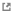

```@setup log
@info "PDB docs"
```

# [PDB](@id Module-PDB)

The module `PDB` defines types and methods to work with protein structures inside Julia. It
is useful to link structural and sequential information, and needed for measure the
predictive performance at protein contact prediction of mutual information scores.

```julia
using MIToS.PDB # to load the PDB module
```

## Features

  - [**Read and parse**](@ref Read-and-parse-PDB-files) mmCIF, PDB, and PDBML files.
  - Download structures from the PDB and AlphaFold databases.
  - Calculate distance and contacts between atoms or residues.
  - Determine interaction between residues.

## Contents

```@contents
Pages = ["PDB.md"]
Depth = 4
```

## Retrieve information from PDB database

This module exports the `downloadpdb` function, to retrieve a PDB file from
[PDB database](http://www.rcsb.org/pdb/home/home.do).
By default, this function downloads a gzipped mmCIF file (`format=MMCIFFile`), which could
be easily read by MIToS. You are able to determine the `format` as `PDBFile` if you want to
download a PDB file instead.

```@example pdb_io
using MIToS.PDB

pdbfile = downloadpdb("1IVO", format = PDBFile)
```

`PDB` module also exports a `getpdbdescription` to access the header information of a
PDB entry.

```@example pdb_io
getpdbdescription("1IVO")
```

## Retrieve information from AlphaFold database

This module provides functions to download and query protein structures from AlphaFold DB.

The `download_alphafold_structure` function downloads the structure file, in mmCIF format
by default, for a given UniProt Accession ID. You can set `format` to `PDBFile` to download
a PDB file instead.

```@example alphafold_io
using MIToS.PDB

# Get the structure for the human insulin
file = download_alphafold_structure("P01308")
```

If you need more information about that entry, you can use the `query_alphafolddb` function.
The `query_alphafolddb` function returns an `JSON.Object` that works like a dictionary.

```@example alphafold_io
json_result = query_alphafolddb("P01308")
```

You can access the information in the `JSON.Object` using the keys. For example, to get
the URL to the PAE matrix image:

```@example alphafold_io
pae_image_url = json_result["paeImageUrl"]
```

## [Read and parse PDB files](@id Read-and-parse-PDB-files)

This is easy using the `read_file` and `parse_file` functions, indicating the filename and the
`FileFormat`: `PDBML` for PDB XML files or `PDBFile` for usual PDB files. These functions
returns a `Vector` of `PDBResidue` objects with all the residues in the PDB.
To return only a specific subset of residues/atoms you can use any of the following
keyword arguments:

| keyword arguments | default | returns only ...                                                   |
|:----------------- |:------- |:------------------------------------------------------------------ |
| `chain`           | `All`   | residues from a PDB chain, i.e. `"A"`                              |
| `model`           | `All`   | residues from a determined model, i.e. `"1"`                       |
| `group`           | `All`   | residues from a group: `"ATOM"`, `"HETATM"` or `All` for both      |
| `atomname`        | `All`   | atoms with a specific name, i.e. `"CA"`                            |
| `onlyheavy`       | `false` | heavy atoms (not hydrogens) if it's `true`                         |
| `occupancyfilter` | `false` | only the atoms with the best occupancy are returned if it's `true` |

!!! note
    
    **For PDBML files** it is possible to use the keyword argument `label` to `false`
    (default to `true`) to get the **auth_** attributes instead of the **label_**
    attributes for `chain`, `atom` and residue `name` fields. The **auth_** attributes are
    alternatives provided by an author in order to match the identification/values used
    in the publication that describes the structure.

```@example pdb_io
# Read α carbon of each residue from the 1ivo pdb file, in the model 1, chain A and in the ATOM group.
CA_1ivo =
    read_file(pdbfile, PDBFile, model = "1", chain = "A", group = "ATOM", atomname = "CA")

CA_1ivo[1] # First residue. It has only the α carbon.
```

## Writing AlphaFold and ColabFold templates

`write_file(path, residues, MMCIFFile)` writes the atom records retained by MIToS.
It does not reconstruct the polymer and header categories expected by the
[AlphaFold mmCIF parser](https://github.com/google-deepmind/alphafold/blob/c77e5d2a8961d1a353632c462914ff0a32a950f6/alphafold/data/mmcif_parsing.py).
For a template derived from selected protein coordinates, use
[`alphafold_mmcifdict`](@ref MIToS.PDB.alphafold_mmcifdict) and write the resulting
dictionary with BioStructures:

```julia
using MIToS.PDB
import BioStructures

# Select the desired protein polymer explicitly. This example uses only ATOM records;
# include modified HETATM residues separately if they belong to the desired polymer.
protein = read_file("input.pdb", PDBFile; chain = "A", model = "1", group = "ATOM")
template = alphafold_mmcifdict(protein; entry_id = "my_template")
BioStructures.writemmcif("tmpl.cif", template)
```

For ColabFold's directory-based custom-template workflow (`--custom-template-path`),
use a **four-character alphanumeric filename stem**, with lowercase letters, such as
`tmpl.cif`. ColabFold builds hit names from the filename, e.g. `tmpl_A`; AlphaFold
expects a four-character identifier and lowercases it when locating the mmCIF file.
This requirement is separate from `entry_id`, which sets the mmCIF data-block name and
`_entry.id`. The descriptive `entry_id = "my_template"` above is valid, but changing
`entry_id` does not fix an incompatible filename.

The helper adds `_chem_comp`, `_entity`, `_entity_poly_seq`, `_struct_asym`, `_entry`
and `_exptl` categories, both label and author atom identifiers, and consistent entity
references. Each selected chain gets its own entity and sequential `label_seq_id`s
starting at 1. Input order within each chain defines the template sequence; author
numbers are not sorted, and gaps are not filled with guessed residues. The sequence
therefore describes **only the selected, observed residues**, not the original full
polymer. Existing PDBe numbering is replaced in the output. MIToS stores only one chain,
residue-name and atom-name namespace, so both label and author fields use those stored
values; the original distinction cannot be recovered after parsing into `PDBResidue`s.

Multi-model input requires an explicit choice, e.g. `model = "14"`. That model is written
as model `1` for AlphaFold. Signed author numbers and single-letter insertion codes are
preserved by default. Duplicate author positions (including alternate residue identities
at one site) are rejected, since their polymer sequence would be ambiguous. Atom
alternative locations within a residue are retained.

Only the 20 standard amino acids get default chemical component types; glycine is
`peptide linking`, the others `L-peptide linking`. Other monomers require explicit types,
for example `chem_comp_types = Dict("MSE" => "L-peptide linking")`. This does not rename
the residue or convert its `HETATM` record. A three-to-one residue mapping does not
establish stereochemistry or polymer membership. Select protein polymer residues only;
exclude solvent, ligands and nucleic acids before export.

No experimental metadata is recovered from coordinates. The default method is `?`
(unknown); no resolution, release date or missing element is invented. Supply a known
`exptl_method` and `release_date = Dates.Date(...)` from the source structure when
available. The date becomes a single revision-history entry, not a reconstructed audit
trail. The returned dictionary can be extended with additional verified metadata.

!!! note "Downstream limits"

    This helper produces a minimal coordinate-derived template, not a wwPDB deposition.
    AlphaFold template date filtering may require a real release date.
    [ColabFold's custom-template preparation](https://github.com/sokrypton/ColabFold/blob/efbf31c37cedb38cd09c69c1b991910a9866480e/colabfold/batch.py)
    may add a fallback date when it is absent and may skip residues with insertion codes.
    For that path, opt into `renumber_auth = true` to replace author residue numbers with
    sequential numbers and remove insertion codes in the output. Keep the original
    residues to retain their source identifiers. Downstream handling of modified residues,
    atom completeness, chain names, sequence matching and template search still applies;
    successful mmCIF parsing alone does not guarantee successful template inference.

## Looking for particular residues

MIToS parse PDB files to vector of residues, instead of using a hierarchical structure
like other packages. This approach makes the search and selection of residues or atoms a
little different.
To make it easy, this module exports the `select_residues` and `select_atoms` functions.
Given the fact that residue numbers from different chains, models, etc. can collide, we
can indicate the `model`, `chain`, `group`, `residue` number and `atom` name using the
keyword arguments of those functions. If you want to select all the residues in one of the
categories, you are able to use the type `All` (this is the default value of such arguments).
You can also use regular expressions or functions to make the selections.

```@example pdb_select
using MIToS.PDB
pdbfile = downloadpdb("1IVO", format = PDBFile)
residues_1ivo = read_file(pdbfile, PDBFile)
# Select residue number 9 from model 1 and chain B (it looks in both ATOM and HETATM groups)
select_residues(residues_1ivo, model = "1", chain = "B", residue = "9")
```

### Getting a `Dict` of `PDBResidue`s

If you prefer a `Dict` of `PDBResidue`, indexed by their residue numbers, you can use the
`residuedict` function.

```@example pdb_select
# Dict of residues from the model 1, chain A and from the ATOM group
chain_a = residuesdict(residues_1ivo, model = "1", chain = "A", group = "ATOM")
chain_a["9"]
```

### Select particular residues

Use the `select_residues` function to collect specific residues. It's possible to use a single
**residue number** (i.e. `"2"`) or even a **function** which should return true for the
selected residue numbers. Also **regular expressions** can be used to select residues.
Use `All` to select all the residues.

```@example pdb_select
residue_list = map(string, 2:5)

# If the list is large, you can use a `Set` to gain performance
# residue_set = Set(map(string, 2:5))
```

```@example pdb_select
first_res = select_residues(
    residues_1ivo,
    model = "1",
    chain = "A",
    group = "ATOM",
    residue = resnum -> resnum in residue_list,
)

for res in first_res
    println(res.id.name, " ", res.id.number)
end
```

A more complex example using an anonymous function:

```@example pdb_select
# Select all the residues of the model 1, chain A of the ATOM group with residue number less than 5

first_res = select_residues(
    residues_1ivo,
    model = "1",
    chain = "A",
    group = "ATOM",
    residue = x -> parse(Int, match(r"^(\d+)", x)[1]) <= 5,
)
# The anonymous function takes the residue number (string) and use a regular expression
# to extract the number (without insertion code).
# It converts the number to `Int` to test if the it is `<= 5`.

for res in first_res
    println(res.id.name, " ", res.id.number)
end
```

### Select particular atoms

The `select_atoms` function allow to select a particular set of atoms.

```@example pdb_select
# Select all the atoms with name starting with "C" using a regular expression
# from all the residues of the model 1, chain A of the ATOM group

carbons = select_atoms(
    residues_1ivo,
    model = "1",
    chain = "A",
    group = "ATOM",
    residue = All,
    atom = r"C.+",
)

carbons[1]
```

## Protein contact map

The PDB module offers a number of functions to measure `distance`s between atoms or
residues, to detect possible interactions or `contact`s. In particular the `contact`
function calls the `distance` function using a threshold or limit in an optimized way.
The measure can be done between alpha carbons (`"CA"`), beta carbons (`"CB"`) (alpha carbon
for glycine), any heavy atom (`"Heavy"`) or any (`"All"`) atom of the residues.

In the following **example**, whe are going to plot a contact map for the *1ivo* chain A.
Two residues will be considered in contact if their β carbons (α carbon for glycine) have a
distance of 8Å or less.

```@example pdb_cmap
using MIToS.PDB

pdbfile = downloadpdb("1IVO", format = PDBFile)

residues_1ivo = read_file(pdbfile, PDBFile)

pdb = select_residues(residues_1ivo, model = "1", chain = "A", group = "ATOM")

dmap = distance(pdb, criteria = "All") # Minimum distance between residues using all their atoms
```

Use the `contact` function to get a contact map:

```@example pdb_cmap
cmap = contact(pdb, 8.0, criteria = "CB") # Contact map
```

```@setup pdb_cmap
@info "PDB: Cmap"
using Plots
gr() # Hide possible warnings
```

```@example pdb_cmap
using Plots
gr()

heatmap(dmap, grid = false, yflip = true, ratio = :equal)

png("pdb_dmap.png") # hide
nothing # hide
```


```@example pdb_cmap
heatmap(cmap, grid = false, yflip = true, ratio = :equal)

png("pdb_cmap.png") # hide
nothing # hide
```


## Structural superposition

```@setup pdb_rmsd
@info "PDB: RMSD"
using Plots
gr() # Hide possible warnings
```

```@example pdb_rmsd
using MIToS.PDB

pdbfile = downloadpdb("2HHB")

res_2hhb = read_file(pdbfile, MMCIFFile)

chain_A = select_residues(res_2hhb, model = "1", chain = "A", group = "ATOM", residue = All)
chain_C = select_residues(res_2hhb, model = "1", chain = "C", group = "ATOM", residue = All)

using Plots
gr()

scatter3d(chain_A, label = "A", alpha = 0.5)
scatter3d!(chain_C, label = "C", alpha = 0.5)

png("pdb_unaligned.png") # hide
nothing # hide
```


```@example pdb_rmsd
superimposed_A, superimposed_C, RMSD = superimpose(chain_A, chain_C)

RMSD
```

```@example pdb_rmsd
scatter3d(superimposed_A, label = "A", alpha = 0.5)
scatter3d!(superimposed_C, label = "C", alpha = 0.5)
png("pdb_aligned.png") # hide
nothing # hide
```


