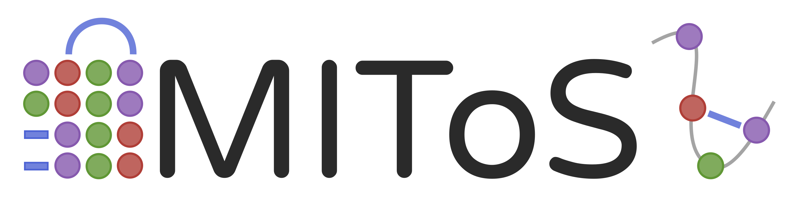

  

*MIToS is an environment for Mutual Information (MI) analysis and implements several
useful tools for Multiple Sequence Alignments (MSAs) and PDB structures management in
the Julia language.*

This is the documentation for MIToS 2.3 in Julia 1.0. If you are using MIToS 1.0 in
Julia 0.4, please read [this documentation](https://diegozea.github.io/mitosghpage-legacy/)
 instead.  

## Modules

MIToS tools are separated on different modules, related to different tasks.

[MSA](@ref Module-MSA) : This module defines multiple functions and types for dealing
with MSAs and their annotations. It also includes facilities for sequence clustering.

[PDB](@ref Module-PDB) : This module defines types and methods to work with protein
structures from PDB.

[SIFTS](@ref Module-SIFTS) : This module allows access to SIFTS residue-level mapping of
UniProt, Pfam and other databases with PDB entries.

[Information](@ref Module-Information) : This module defines residue contingency tables
and methods on them to estimate information measure from MSAs. It includes functions to
estimate corrected mutual information (ZMIp, ZBLMIp) between MSA columns.  

[Pfam](@ref Module-Pfam) : This module use the previous modules to work with Pfam MSAs.
It also has useful parameter optimization functions to be used with Pfam alignments.  

[Utils](@ref API-Utils) : MIToS has also an Utils module with common utils functions and
types used in this package.  

## Citation  

If you use MIToS, please cite:

Diego J. Zea, Diego Anfossi, Morten Nielsen, Cristina Marino-Buslje; MIToS.jl: mutual information tools for protein sequence analysis in the Julia language, Bioinformatics, Volume 33, Issue 4, 15 February 2017, Pages 564–565, [https://doi.org/10.1093/bioinformatics/btw646](https://doi.org/10.1093/bioinformatics/btw646)  

  

Structural Bioinformatics Unit, Leloir Institute Foundation.
Av. Patricias Argentinas 435, CP C1405BWE, Buenos Aires, Argentina
